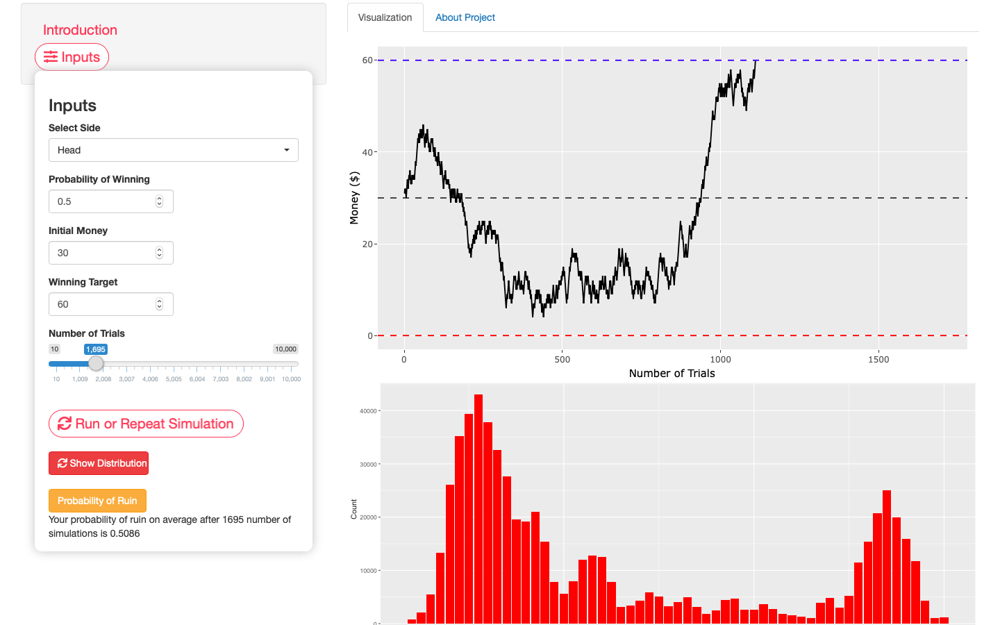

Gambler’s Ruin Problem Simulation
Created in R language and Shiny framework

## Technologies
This app is programmed in:
* [R language in Rstudio](https://rstudio.com/)
* [Shiny framework](https://shiny.rstudio.com/)
* HTML5

## Requirements
In order to run this app in your own machine you need:
* [Installing Rstudio](https://rstudio.com/products/rstudio/)
* Install Shiny package -> library(shiny)
 * library(shinywidgets)
 * library(shinyalert)
 * library(ggplot2)
 * library(plotly)
 
## Demo and Gallery



## Introduction

This is my [shinyapp
project]() to
demonstrate the stochastic process or random walk in a probability game
using gambler’s ruin problem as the objective. You flip a coin and
choose for example, head. You bet your money on each flip, Each time the
head side of the coin appeared you earn 1$ (+1), otherwise tail appeared
you lose $1 (-1). You start with initial stake (money) of k dollar, and
you want to make profit of e dollar (e \> k). The game stops if you
either reach e dollar or win, or lose all your money to 0 (ruin). How
much money you’d have after certain number of trials (flips)? Will you
eventually reach e dollar (win) or other wise lose all your money to 0
(ruined) after certain trials? This is a classic probabiliy game first
disscussed by Blaise Pascal and Pierre de Fermat.

### Mathematical Overview

When the coin is tossed, it either toss head or tail, with probability
of p (head) and 1-p (tail). Consider when we start with initial money or
stake of k dollar, and bet on each flip. Our money will exhibit a random
walk (stochastic process) phenomenon in which it either unpredictably go
or down. A stochastic process is built as follows: Let X1, X2,… be a
sequence of i.i.d (independent and identically distributed) random
variables with Xk = +1 with probability of P and Xk = -1 with probabiity
of 1-P. for k 1 we set Sn = X1 + … + Xn, for n \>= 1 with S0 = 0, Then
Sn is the random walk’s position after n steps. The sequence of S0, S1,
S2… is a discrete-time stochastic process whose state space is Z, the
set of all integers. Here you’ll find that the probability of ruin after
certain number of trials is (n-k)/n.
Math reference :
* [random walk gambler's ruin (MIT)](https://web.mit.edu/neboat/Public/6.042/randomwalks.pdf)
* [gambler's ruin video (MIT)](https://www.youtube.com/watch?v=6wUD_gp5WeE)

## Generating event outcome for each number of trial
The code below is the loop function to generate sequences of outcome from coin flips, returning (randomly) value of 1 and -1 at each trial.

```{r}

judi <- function(k,n,p) {
    # k = initial stake, n = win target, p = win probability
    stake <- k
    while (stake > 0 & stake < n) {
      bet <- sample(c(-1,1), 1, prob = c(1-p, p))
      
      return(bet)
    }
  }
  
```

## Monte carlo simulation

This code runs monte carlo simulation by re-running or repeating the
sample’s outcome from function judi using inputted initial stake as k,
win target input as n, and winning probability as p Repeated up to
inputted number of simulations times. As an example, here i input k =
20, n = 60, p = 0.5, and number of trials = 100 resulting in a vector of
1 and -1 representing the outcome of each coin flip trial. If we choose
head, then value of 1 means head appears (we gain +1 more dollar) and
value of -1 means tail appears (we lose -1 dollar)

``` {r}
  set.seed(123456)
    k <- 20 ## initial money
    n <-  60 ## win target ($)
    p <- 0.5  ## probability of winning
    trials <- 100 ## number of trial simulation
    simlist <- replicate(trials, judi(k, n, p)) ## monte carlo simulation
    simlist
```

### Accumulating the money for each coin flip result (trial)

Code below is a function to return the value of money after certain
number of trials. Our initial money is 20$ and prior to the monte carlo
simulation (simlist) we get value of (-1, -1, 1, 1, -) for the first 5
trials. Therefore given initial money of 20 dollar, at the first trial
our money is (20 - 1 = 19) dollar, second trial is 20 - 1 - 1 = 18
dollar, third trial is 20 - 1 - 1 + 1 = 19 dollar and at fifth trial our
money is 20 - 1 - 1 + 1 + 1 + 1 = 21 dollar.


## Monte carlo simulation
This code runs monte carlo simulation by re-running or repeating the sample's outcome from function judi using inputted initial stake as k, win target input as n, and winning probability as p. Repeated up to inputted number of simulations times. As an example, here i input k = 20, n = 60, p = 0.5, and number of trials = 100 resulting in a vector of 1 and -1 representing the outcome of each coin flip trial. If we choose head, then value of 1 means head appears (we gain +1 more dollar) and value of -1 means tail appears (we lose -1 dollar)

```{r}
  set.seed(123456)
	k <- 20 ## initial money
	n <-  60 ## win target ($)
	p <- 0.5  ## probability of winning
	trials <- 100 ## number of trial simulation
	simlist <- replicate(trials, judi(k, n, p)) ## monte carlo simulation
	simlist
```

### Accumulating the money for each coin flip result (trial)
Code below is a function to return the value of money after certain number of trials. Our initial money is 20$ and prior to the monte carlo simulation (simlist) we get value of (-1, -1, 1, 1, -) for the first 5 trials. Therefore given initial money of 20 dollar, at the first trial our money is (20 - 1 = 19) dollar, second trial is 20 - 1 - 1 = 18 dollar, third trial is 20 - 1 - 1 + 1 = 19 dollar and at fifth trial our money is 20 - 1 - 1 + 1 + 1 + 1 = 21 dollar.

```{r}
 total_gain <- function(k, trials, monte){
      
      step <- c()
      
      for (i in 1:trials) { ##for each trial
        step[i] = k + sum(monte[1:i]) ## sum the value of initial stake (k) to the value outcome (1 or -1) of the simulation tr (simlist)
        
        if (step[i] == 0 | step[i] == n) {
          break
      }
    }
  return(step[1:trials])
      
    }
    
    profit <- total_gain(20, 100, simlist)
    profit

```

After generating the value of the money after number of simulations,
next thing is to make a discrete sequence representing each trial as
time variable, this is used as the X axis when we make a plot later.
Variable accum\_gain binds the profit and time vector and returns a data
frame with “Money” and “Trials” variables.

After generating the value of the money after number of simulations, next thing is to make a discrete sequence representing each trial as time variable, this is used as the X axis when we make a plot later. Variable accum_gain binds the profit and time vector and returns a data frame with "Money" and "Trials" variables.

```{r}
    time <- seq(1, 100, 1)

    accum_gain <- data.frame(cbind(profit, time))
      names(accum_gain)[1] <- "Money"
      names(accum_gain)[2] <- "Trials"
      head(accum_gain)
```

### Plotting the money and sequences (trials)


Code for plotting the money and sequences up to 100 trials. If the chart
hits blue line (win target of 60$) then the game stops and the player
win, otherwise the plot hits red line (ruin threshold of 0) the players
lose all the money to 0 dollar and said to be ruined.


Code for plotting the money and sequences up to 100 trials. If the chart hits blue line (win target of 60$) then the game stops and the player win, otherwise the plot hits red line (ruin threshold of 0) the players lose all the money to 0 dollar and said to be ruined.

```{r}

    gain_plot <- ggplot(accum_gain, aes(x = Trials, y = Money)) + 
        geom_line() + 
        geom_hline(yintercept = c(0, 60), ### Horizontal lines representing ruin threshold (red dashed line) and win threshold (blue dashed line)
                  linetype="dashed", 
                  color = c("red", "blue"), 
                  size = 0.5) +
        ylim(c(0, 60)) + 
        xlim(c(1, 100)) + 
        xlab("Number of Trials") + ylab("Money ($)")
        gain_plot + geom_hline(yintercept = 20, linetype="dashed",  ### adding black dashed line as initial money
                           color = "black", size = 0.5, alpha = 0.75)
```

### Plotting money distribution plot


Distribution plot to show the distribution of the money

```{r}
dist_plot <- ggplot(accum_gain, aes(x = Money, y = Trials)) +
        geom_col(fill = "red",
                 size = 0.2) +
        xlab("Money") +
        ylab("Count")
dist_plot
```

## Generating probability of ruin (losing all money) after 100 simulations

The code below generates sample’s outcome from each trial and return
value of 1 if we lose our initial money to 0 (ruin) and 0 if we win or
hits the win target threshold. Then the average probability of ruin is
calculated by summing all the returned value from the monte carlo
simulation (prob\_result) divided by number of simulations.


The code below generates sample's outcome from each trial and return value of 1 if we lose our initial money to 0 (ruin) and 0 if we win or hits the win target threshold. Then the average probability of ruin is calculated by summing all the returned value from the monte carlo simulation (prob_result) divided by number of simulations.

```{r}
    
    gamble <- function(k,n,p) {
      stake <- k
      
      while (stake > 0 & stake < n) {
        bet <- sample(c(-1,1),1,prob=c(1-p,p))
        stake <- stake + bet
        
      }
      
      if (stake == 0) 
        return(1) 
      else return(0)
      
    }
```


prob_result <- replicate(100, gamble(20, ## this function generates monte carlo simulation over gamble function with k = 20, n = 60, p = 0.5 up to 100 simulations 
                                  60, 
                                  0.5))
head(prob_result, n = 10)
paste("Your probability of ruin is", mean(prob_result)) # the mean of probability is calculated by summing all the returned value of prob result divided by number of simulations


Alright. That’s the demo of how this program works in the backend,
however the actual codes for the shinyapp is different due to additional
shiny syntax like reactive(), eventReactive, isolate(), input$x, User
interface codes, etc. Nevertheless, these introduction document provides
you clear picture of how to generate probability and probability
outcome, the functions to work on certain purpose and generate results,
the monte carlo simulations, the plotting. Thank you for your attention.
The full code is provided at

Alright. That's the demo of how this program works in the backend, however the actual codes for the shinyapp is different due to additional shiny syntax like reactive(), eventReactive, isolate(), input$x, User interface codes, etc. Nevertheless, these introduction document provides you clear picture of how to generate probability and probability outcome, the functions to work on certain purpose and generate results, the monte carlo simulations, the plotting. Thank you for your attention.
The full code is provided at
